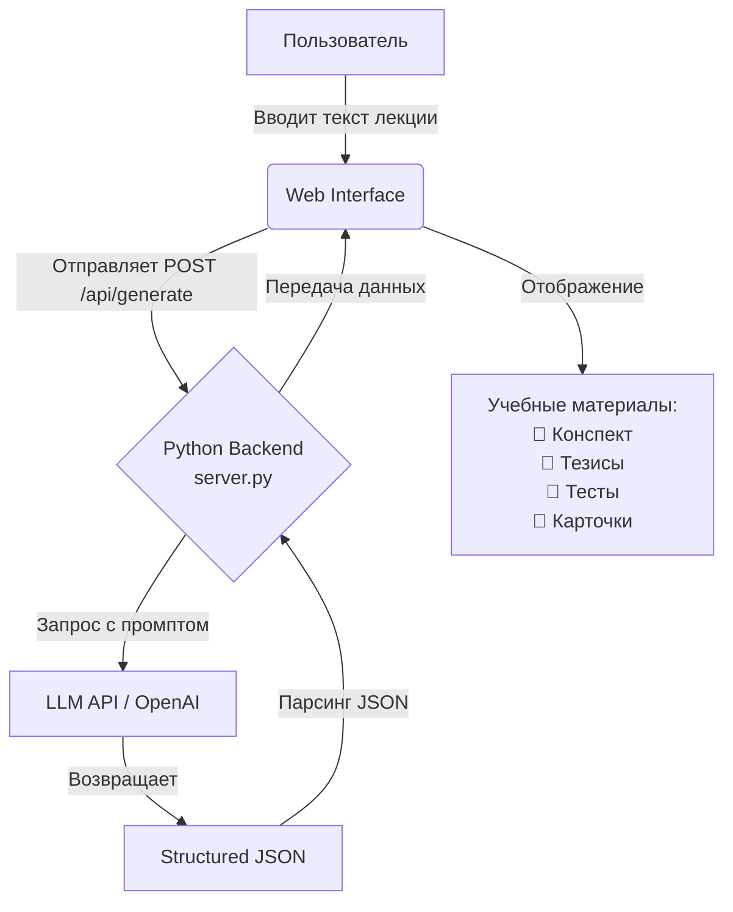

# 🧠 AI Помощник Лекций (Apex AI)

Прототип веб-приложения для подготовки учебных материалов на основе текста лекций, созданный для хакатона **HackAlem AI**.

---

## 🎯 О проекте

Современные студенты тратят часы на разбор лекций, повторный просмотр записей и создание конспектов. Из-за большого объёма неструктурированной информации часто упускаются ключевые темы, а на подготовку тестов и карточек для самопроверки не остаётся времени.

**Наш продукт** — это интеллектуальный веб-инструмент, который автоматизирует этот процесс. Он предназначен для студентов и преподавателей, позволяя за пару секунд превратить сырой текст лекции в готовый набор структурированных учебных материалов.

## 💡 Решение

Идея продукта максимально проста: пользователь загружает текст лекции, а ИИ-модель анализирует его и выдаёт комплексный учебный набор.

**Основной сценарий:**
Текст лекции ➡️ AI-анализ ➡️ Конспект + Тезисы + Тест + Карточки

## ✨ Возможности

- **Генерация конспекта**: автоматическое создание сжатого изложения материала.
- **Выделение тезисов**: формирование списка ключевых идей лекции.
- **Генерация тестовых вопросов**: создание интерактивных вопросов (с вариантами ответов и правильным выбором) для самопроверки.
- **Генерация карточек**: формирование двусторонних flash-карточек (вопрос/термин — ответ).
- **Source-grounded подход**: жесткое ограничение генерации исключительно содержанием загруженной лекции.
- **Обработка ошибок**: интуитивно понятные сообщения при пустом вводе, ошибках API или отсутствии информации.
- **Повторная обработка**: возможность генерировать материалы для нескольких лекций подряд без перезагрузки страницы.
- **Mock-режим**: встроенный тестовый режим для демонстрации работы интерфейса без необходимости тратить токены реального LLM API.

## 🛡️ Достоверность и защита от галлюцинаций

Важнейшая часть проекта — достоверность генерируемых материалов:
- AI получает в качестве контекста **только исходный текст лекции**.
- В системном prompt'е заложено строгое правило: **не использовать внешние знания**.
- Если в тексте лекции нет достаточной информации для ответа на вопрос или составления карточек, модель обучена возвращать пустые массивы или сообщать об отсутствии информации, а не выдумывать факты.
- Тестовые вопросы и ответы имеют прослеживаемую связь с исходным материалом.

*Примечание: абсолютная защита от галлюцинаций недостижима при использовании LLM, однако реализованный prompt-based механизм существенно минимизирует этот риск.*

## 🔄 Как работает система



**Компоненты:**
1. **Пользователь** взаимодействует с минималистичным и адаптивным HTML/JS интерфейсом.
2. **Web Interface** валидирует данные и отправляет их на сервер без перезагрузки страницы.
3. **Python Backend** принимает текст, проверяет конфигурацию, формирует контекст и безопасно общается с AI.
4. **LLM API** обрабатывает текст и возвращает предсказуемый и валидный JSON.

## 🏗️ Архитектура

Проект построен по архитектуре **Client-Server** с использованием Zero-dependency подхода:
- **Frontend** — статичные файлы (`index.html`, `style.css`, `script.js`). Выполняет роль SPA (Single Page Application) с табами для отображения результатов.
- **Backend** — монолитный сервер (`server.py`), реализованный на стандартной библиотеке Python `http.server`. Он одновременно отдает статические файлы и выступает в роли API-шлюза для общения с провайдером LLM, обеспечивая безопасность API-ключей (они не попадают на клиент).

## 🛠️ Технологии

Мы выбрали максимально простой и надёжный стек:
- **Python 3** (для Backend)
- **Встроенные библиотеки Python** (`http.server`, `urllib`, `json`, `os`) — **Zero-dependency MVP**, не требует `pip install` сторонних серверов!
- **HTML5 / CSS3 / Vanilla JavaScript** (для Frontend)
- **OpenAI API** (интерфейс LLM с JSON-режимом)

## 📂 Структура проекта

```text
├── .env.example       # Шаблон конфигурационного файла
├── .gitignore         # Исключения для Git (защита ключей)
├── README.md          # Документация проекта
├── server.py          # Основной бэкенд и API сервер (Zero-dependency)
├── test_api.py        # Скрипт для тестирования API-сервера
└── static/            # Папка со статическим фронтендом
    ├── index.html     # Основная разметка приложения
    ├── style.css      # Стили интерфейса
    └── script.js      # Клиентская логика (вкладки, отправка запросов, рендеринг)
```

## 🚀 Установка и запуск

MVP работает "из коробки" при наличии установленного Python 3.

1. **Склонируйте репозиторий**:
   ```bash
   git clone https://github.com/BAITC-Hacks/hack-0f13daa3-apex-ai.git
   cd hack-0f13daa3-apex-ai
   ```

2. **Настройте переменные окружения**:
   Скопируйте пример файла конфигурации:
   ```bash
   cp .env.example .env
   ```
   *Отредактируйте `.env`, добавив свой API ключ.*

3. **Запустите сервер**:
   ```bash
   python server.py
   ```

4. **Откройте приложение**:
   Перейдите в браузере по адресу: **http://localhost:8000/**

## 🔑 Конфигурация

Все настройки приложения хранятся в локальном файле `.env` (он скрыт из Git для безопасности).

**Доступные параметры (`.env.example`):**
- `OPENAI_API_KEY`: Ваш секретный токен для доступа к LLM. Никогда не публикуйте его в репозитории!
- `OPENAI_BASE_URL`: Позволяет использовать провайдеров, совместимых с OpenAI API (опционально).
- `MODEL_NAME`: Имя модели LLM (по умолчанию `gpt-3.5-turbo` или иная доступная).
- `MOCK_LLM`: Режим "заглушки". Значение `True` позволяет тестировать фронтенд без траты реальных токенов. При значении `False` выполняется реальный вызов LLM.

## 🧪 Как проверить

Чтобы протестировать MVP и оценить его функционал:

1. Запустите приложение (`python server.py`) и откройте **http://localhost:8000/**.
2. В файле `.env` убедитесь, что включен тестовый режим (`MOCK_LLM=True`), либо введите валидный ключ и поставьте `MOCK_LLM=False`.
3. В текстовое поле скопируйте любой текст лекции (например, статью про историю Рима).
4. Нажмите **"Создать материалы"** и дождитесь индикатора загрузки.
5. Прокликайте вкладки:
   - Проверьте **Конспект** и **Тезисы**.
   - Перейдите в **Тесты** (проверьте наличие вариантов ответа и выделение правильного).
   - Перейдите в **Карточки** (нажмите на карточку, чтобы увидеть ответ).
6. **Защита от выдумывания**: попробуйте отправить пустой текст. Система мгновенно выдаст предупреждение. Попробуйте отправить текст, состоящий из слова "Привет", и проверьте, как ИИ справится с нехваткой данных.

## 📊 Что реализовано по требованиям HackAlem AI

| Требование | Реализация |
|---|---|
| Принять текст лекции через Web-интерфейс | ✅ Реализовано (TextArea на странице) |
| Создать краткий конспект | ✅ Реализовано (вкладка "Конспект") |
| Создать список тезисов | ✅ Реализовано (вкладка "Основные тезисы") |
| Создать тестовые вопросы с вариантами | ✅ Реализовано (вкладка "Тест") |
| Создать карточки для повторения | ✅ Реализовано (вкладка "Карточки", интерактивные) |
| Работа без перезапуска | ✅ Реализовано (AJAX запросы, интерфейс не перезагружается) |
| Ограничение фактами лекции | ✅ Реализовано (Строгий prompt / System instruction) |
| Обработка пустого ввода и ошибок | ✅ Реализовано (UI-нотификации без падения приложения) |

## ⚠️ Ограничения текущего MVP
- Система работает только с текстовым форматом лекции (без поддержки видео, аудио или PDF из коробки).
- Качество генерации зависит от возможностей конкретной языковой модели.
- Зависимость от работоспособности внешнего API провайдера (OpenAI).

## 🔮 Возможное развитие (Future Work)
- **Мультимодальность**: Поддержка загрузки аудиозаписей и видеолекций с автоматической транскрипцией (Speech-to-Text).
- **Экспорт данных**: Возможность скачивать материалы в PDF или интеграция карточек с Anki.
- **Персонализация**: Настройка уровня сложности тестов (от базового до продвинутого).
- **База данных**: Сохранение истории обработанных лекций в профиле пользователя.

---
*Проект создан командой Apex AI в рамках HackAlem AI 2026*
